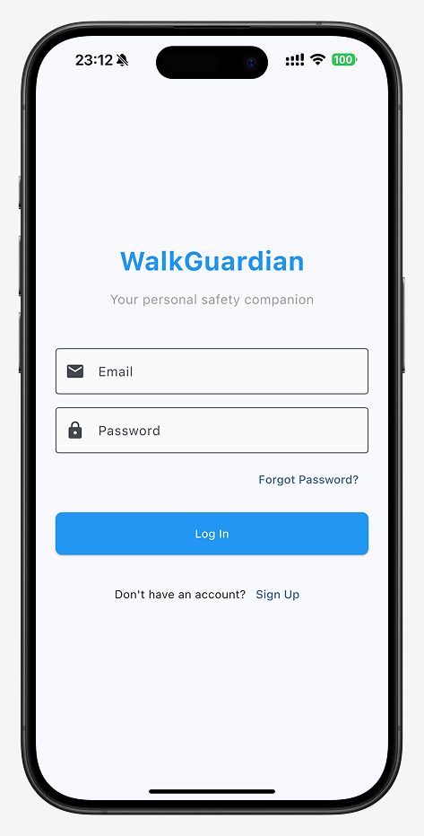
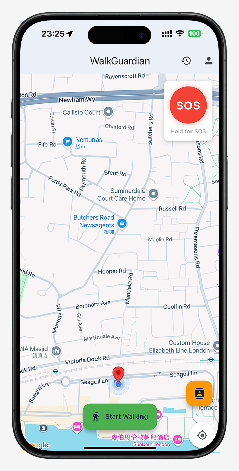
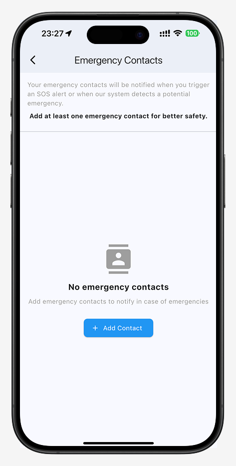
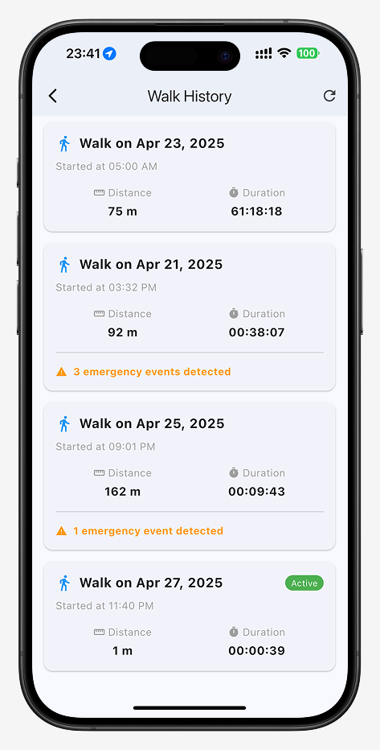

# Walk_Guardian

## 📱 Project Overview

*Walk Guardian* is a simple mobile application designed to help users feel safer when walking alone. It allows you to track your location in real time, keep a record of your journeys, and quickly send an alert to emergency contacts if needed. Built using Flutter, the app focuses on ease of use and essential safety features, providing a reliable way to stay connected and protected during solo walks, especially at night or in unfamiliar areas.

Walk Guardian aims to support **solo travelers**, **young individuals**, **women walking alone at night**, and **elderly people** during independent outdoor activities.

## 📚 Table of Contents
- [Project Overview](#-project-overview)
- [Key Features](#-key-features)
- [App Screenshots](#-app-screenshots)
- [Technologies Used](#-technologies-used)
- [User Journey](#-user-journey)
- [Installation](#-installation)
- [Future Improvements](#-future-improvements)
- [Contact](#-contact)

---

## ✨ Key Features

- **🧭 Real-Time Location Tracking**  
  Displays and monitors the user’s current GPS location on a map.

- **📍 Journey Monitoring**  
  Logs walking routes and duration, highlighting any emergencies during the walk.

- **🆘 Emergency Features**  
  - **Manual SOS Activation**:  
    Long-press the red SOS button to manually send location alerts to a pre-set emergency contact.  
    
    
  - **Fall Detection Alert**:  
    Automatically detects sudden falls and sends an SOS alert if the user does not cancel within a countdown.  
    

- **📇 Emergency Contacts Management**  
  Add, edit, or delete trusted contacts for emergency notifications.

- **👤 User Profile**  
  Stores user info such as name, email, and phone number, assisting responders.

---

## 🖼 App Screenshots

| Login Screen | Map Screen |
|:---:|:---:|
|  |  |

| Emergency Contact Screen | Walk History Screen |
|:---:|:---:|
|  |  |

---


## 🧠 Technologies Used

- **Framework**: Flutter (Dart)
- **APIs**:
  - Google Maps API
  - Firebase Firestore
- **Device Sensors**:
  - GPS
  - Motion (Accelerometer，identifying user falls through threshold judgment)
- **Supported Platforms**: Android & iOS

---

## 🧭 User Journey

1. **Launch the App** – open Walk Guardian on your device.
2. **Create Account / Log In** – register a new account or log in using existing credentials.
3. **Set Emergency Contacts** – add trusted contacts who will receive SOS alerts.
4. **Tap "Start Walking"** – begin journey monitoring with real-time location tracking.
5. **Hold SOS Button** – send an instant alert with live location if feeling unsafe.
6. **End Walk** – complete the journey and stop tracking.
7. **View Walk History** – check the summary of previous journeys and any emergency events.

---

## 🚀 Installation

### Pre-requirements:
- Install [Flutter](https://flutter.dev/) and [Dart](https://dart.dev/)
- Set up an emulator (Android/iOS) or connect a physical device

### Steps:
```bash
git clone https://github.com/XLunaXX07/CASA0015-Mobile-Systems-Interactions.git
cd CASA0015-Mobile-Systems-Interactions
flutter pub get
flutter run
```

✅ Now Walk Guardian should be running on your device!


---

## 🌟 Future Improvements

**Wearable Device Integration**  
   Support integration with smartwatches (e.g., Apple Watch, Wear OS) to trigger emergency alerts directly from wearable devices.

**Trusted Contact Real-Time Tracking**  
   Enable trusted contacts to temporarily track the user’s live location after an SOS alert is triggered, enhancing emergency response.

**Voice Command Activation**  
   Implement voice-activated SOS triggers for situations where the user may not be able to operate the phone manually.

**Enhanced User Interface (UI/UX)**  
   Introduce a more customizable UI theme (e.g., light/dark mode, accessibility options) to accommodate different user preferences and improve usability.

---

## 📬 Contact

If you have any questions, feedback, or collaboration ideas regarding **Walk Guardian**, feel free to reach out:

- 📧 Email: ucfnyz3@ucl.ac.uk
- 🐙 GitHub: [XLunaXX07](https://github.com/XLunaXX07)

---
